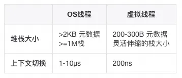
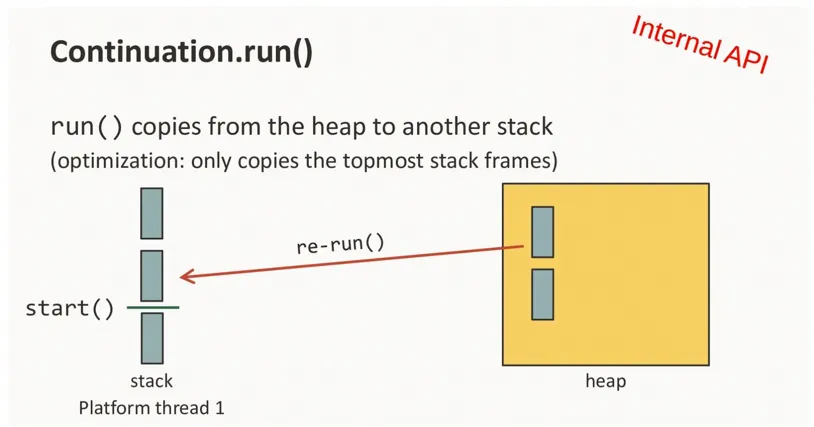
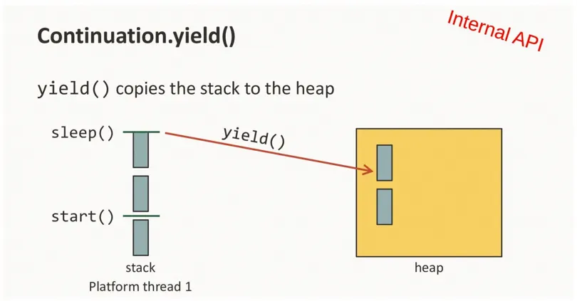
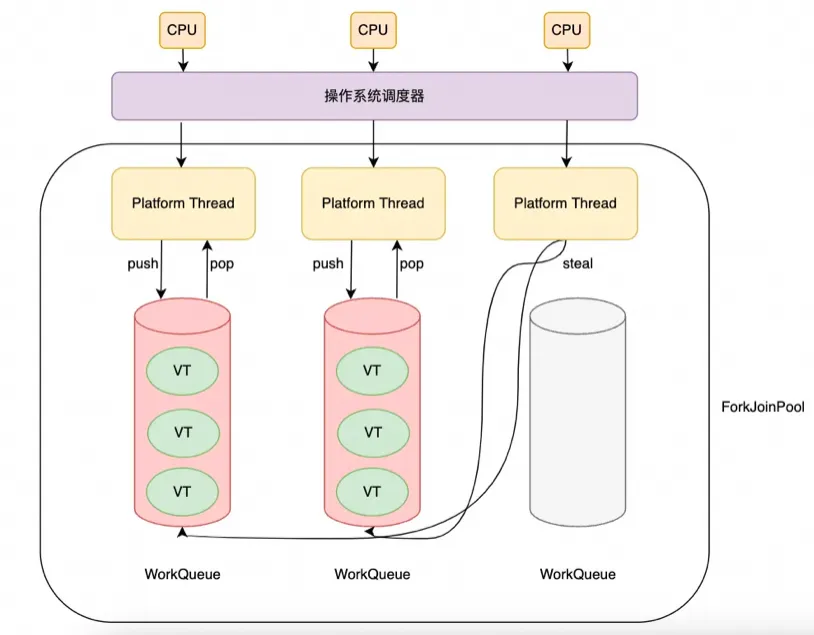

# 什么是虚拟线程？

虚拟线程就是其他语言中的协程（比如go）。可以简单理解为一种用户态线程，和操作系统线程的关系由原来的1对1，变成M(虚拟线程)对N(
os线程)的关系。

# 为什么要有虚拟线程？

* os不知道用户态如何使用线程，所以jvm会分配一个默认的大小（可以通过-XX:ThreadStackSize修改），通常会比实际使用的要大很多,也就导致在cup或者网络连接耗尽之前
  线程数量先达到上线。
* 线程上下文切换要通过内核调度进行，相对更慢;

os线程的开销限制了java程序不能创建太多的线程，导致硬件资源利用不够。其次再java使用线程需要设置线程池
来管理线程，不如go协程使用简单。

## 一些解决方案

### 1.使用异步

放弃单个请求单个线程的吃力方式，而是在等待io操作时，将线程还给线程池，以便线程可以为其他请求提供服务。
这种细粒度的线程共享（代码仅在执行计算时（而不是在等待 I/O 时）保留线程，允许大量并发操作，而不会消耗大量线程。
不等待io，而是回调通知。比如CompletableFuture或者所谓的响应式框架。好处是请求的每个阶段都可以在不用的
线程上执行，坏处就是失去了顺序执行，提高的调试的难度。

### 2.使用虚拟线程

正如操作系统将虚拟地址空间映射到有限数量的物理地址空间，给人一种内存充足的错觉。java运行时可以通过将大量的虚拟内存映射到少量的操作系统线程
来给人一种线程充足的错觉。当虚拟线程使用cpu执行计算时才使用os线程，当执行阻塞io操作时运行时将执行非阻塞系统调用。并自动挂起虚拟线程，直到以后
可以恢复。

## 虚拟线程的含义

虚拟线程的成本非常低，所以永远不应该被池化。应该为每个应用程序任务分配一个新的虚拟线程。因此，大多数虚拟线程的生存期很短。并且调用堆栈浅。



虚拟线程真正擅长的是等待，等待大量阻塞操作完成。它能提供的是 scale（更高的吞吐量），而不是 speed（更低的延迟）。
虚拟线程最适合的是原来需要更多线程数来处理计算无关业务的场景，典型的就是像web容器、数据库、文件操作一类的IO密集型的应用。

虚拟线程的调用堆栈存在java堆上，而不是os分配的栈区域。

虚拟线程的运行实际上就是两个操作

* 挂载（mount）：挂载虚拟线程意味着将所需的栈帧从堆中临时复制到载体线程的堆栈中，并在挂载时借用载体堆栈执行。



卸载（unmount）：当在虚拟线程中运行的代码因为 IO、锁等原因阻塞后，它可以从载体线程中卸载，然后将修改的栈帧复制回堆中，从而释放载体线程以进行其他操作（例如运行另一个虚拟线程）。对应的，JDK
中几乎所有的阻塞点都已经过调整，因此当在虚拟线程上遇到阻塞操作时，虚拟线程会从其载体上卸载而不是阻塞。



scheduler:可以使用ForkJoinPool可以用。work-stealing + FIFO，性能很好。



JDK中的一些阻塞操作不会卸载虚拟线程，因此会阻塞其载体线程。这是因为操作系统级别（例如，许多文件系统操作）或JDK级别（例如，Object.wait()
）的限制。这些阻塞操作的解决方式是，通过临时扩展scheduler的并行性来补偿操作系统线程的捕获。因此，scheduler的ForkJoinPool中的平台线程数量可能暂时超过CPU核数。

# 如何使用？

## 1.简单的使用
```
try (var executor = Executors.newVirtualThreadPerTaskExecutor()) {
    IntStream.range(0, 10_000).forEach(i -> {
        executor.submit(() -> {
            Thread.sleep(Duration.ofSeconds(1));
            return i;
        });
    });
}  // executor.close() is called implicitly, and waits
```

在这种情况下提高虚拟线程数，就可以提高吞吐量。但是如果任务是一个巨大计算任务，比如排序，那么超出cpu核数的线程数将毫无作用。

换句话说，虚拟线程可以在以下情况下显著提高应用程序吞吐量

* 并发任务的数量很多（超过几千个），并且工作负载不受 CPU 限制，因为在这种情况下，线程数比处理器内核多得多，无法提高吞吐量。

## 2.请求合并
```
handleExecutorService

void handle(Request request, Response response) {
    var url1 = ...
    var url2 = ...
 
    try (var executor = Executors.newVirtualThreadPerTaskExecutor()) {
        var future1 = executor.submit(() -> fetchURL(url1));
        var future2 = executor.submit(() -> fetchURL(url2));
        response.send(future1.get() + future2.get());
    } catch (ExecutionException | InterruptedException e) {
        response.fail(e);
    }
}
 
String fetchURL(URL url) throws IOException {
    try (var in = url.openStream()) {
        return new String(in.readAllBytes(), StandardCharsets.UTF_8);
    }
}
```
比如这样做请求合并

## 3.使用信号量限制虚拟线程，而不是固定大小的线程池

##
