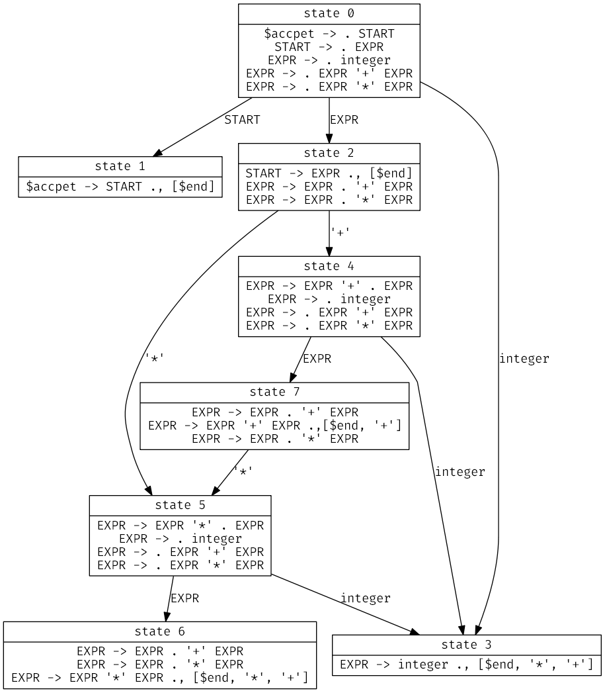

goyacc/main.go 源码阅读
===

&emsp;&emsp;goyacc 根据文法定义文件生成 LALR(1) Parser，这里我们先通过一个简单的例子分析生成的 Parser 的执行过程，再分析
goyacc
的主要执行逻辑。对文法定义等内容不熟悉的同学可以参看 [TiDB 源码阅读系列文章（五）TiDB SQL Parser 的实现](https://pingcap.com/blog-cn/tidb-source-code-reading-5/)
一文。

## LALR(1) Parser 的执行过程

&emsp;&emsp;这里先给出一个简单的文法：

```
// filename: calc.y
...
%union {
	value int
}

%token integer

%left '+'
%left '*'

%type<value> EXPR integer

%start START
%%
START:
	EXPR
	{
		fmt.Println("=", $1)
	}

EXPR:
	integer
	{
		$$ = $1
	}
|	EXPR '+' EXPR
	{
		$$ = $1 + $3
	}
|	EXPR '*' EXPR
	{
		$$ = $1 * $3
	}
%%
...
```

该文法实现了只支持整数的加法和乘法的计算器功能。运行

```
goyacc -o calc.go calc.y
```

我们可以得到对应的 Parser。

&emsp;&emsp;LALR(1) Parser 的运行依赖于状态栈，在代码中表示为 `yyS`。`yyS` 的元素类型是 `yySymType`，

```go
type yySymType struct {
	yys   int
	value int
}
```

其中 `yys` 表示状态，`value` 是我们在 `%union`
中定义的表达式的值类型。除此之外我们还需要关心定义在代码头部的 `yyXLAT`、`yyReductions` 和 `yyParseTab`。下面给出上述文法对应的这三个结构。

```go
yyXLAT = map[int]int{
	57344: 0, // $end (5x)
	42:    1, // '*' (4x)
	43:    2, // '+' (4x)
	57348: 3, // EXPR (3x)
	57346: 4, // integer (3x)
	57349: 5, // START (1x)
	57347: 6, // $default (0x)
	57345: 7, // error (0x)
}

yyReductions = []struct{ xsym, components int }{
	{0, 1},
	{5, 1},
	{3, 1},
	{3, 3},
	{3, 3},
}

yyParseTab = [8][]uint8{
	// 0
	{3: 7, 8, 6},
	{5},
	{4, 10, 9},
	{3, 3, 3},
	{3: 12, 8},
	// 5
	{3: 11, 8},
	{1, 1, 1},
	{2, 10, 2},
}

// 与 yyParseTab 配合使用
const yyTabOfs = -5
```

其中 `yyXLAT` 是一个从 Lexer 获取到的原始 token 到 Parser 中使用的 token 号的映射。`yyReductions` 是文法定义的 reduce
规则。需要注意的是我们只定义了4条规则，但 `yyReductions` 中却有5个项目。从同时生成的 y.output 我们可以看到这5个项目分别对应如下的5条产生式：

```
0 $accept -> START
1 START -> EXPR
2 EXPR -> integer
3 EXPR -> EXPR + EXPR
4 EXPR -> EXPR * EXPR
```

`yyReductions` 每个元素中 `xsym` 表示对应产生式左端 token 的编号，`components` 表示产生式右端的 token 个数。`yyParseTab` 是
LALR(1) 分析表，每输入一个 token，`yyParseTab[当前栈顶状态][输入的 token 号] + yyTabOfs` （记作 `yyn`）表示下一步操作。

- 若 `yyn` 大于0，则进行 shift，状态转移到 `yyn` （即将 `yyn` 压入 `yyS` 栈顶，下同）；
- 若 `yyn` 小于0，则使用 `yyReductions[-yyn]` （记作 `x0`） 规则进行 reduce，在状态栈顶弹出 `x0.components`
  个元素后状态转移到 `yyParseTab[弹出后栈顶状态][x0.xsym] + yyTabOfs`，此时新状态中的 `value` 通过 reduce 使用的产生式对应的
  go 语句得到。在这种情况下输入的 token 会继续用于下一轮循环，即不会从 Lexer 获取新的 token；
- 若 `yyn` 等于0，
    - 若还有当前状态等于1，则 accept，
    - 否则报错。

&emsp;&emsp;下面通过一个简单的 `2+3*4` 句子来演示 Parser 的工作流程。状态栈中 `(x,y)` 的记法表示一个 `yys = x, value = y`
的状态；状态栈左边为栈底，输入栈右边为栈底，栈底用 `$` 表示。

|     | 状态栈                             | 输入栈    | 说明                     |
|-----|:--------------------------------|--------|------------------------|
|     | $(0,0)                          | 2+3*4$ | 初始状态                   |
|     | $(0,0)(3,2)                     | +3*4$  | 输入 `2`，shift           |
|     | $(0,0)(2,2)                     | +3*4$  | reduce，使用产生式2          |
|     | $(0,0)(2,2)(4,2)                | 3*4$   | 输入 `+`，shift           |
|     | $(0,0)(2,2)(4,2)(3,3)           | *4$    | 输入 `3`，shift           |
|     | $(0,0)(2,2)(4,2)(7,3)           | *4$    | reduce，使用产生式2          |
|     | $(0,0)(2,2)(4,2)(7,3)(5,3)      | 4$     | 输入 `*`，shift           |
|     | $(0,0)(2,2)(4,2)(7,3)(5,3)(3,4) | $      | 输入 `4`，shift           |
|     | $(0,0)(2,2)(4,2)(7,3)(5,3)(6,4) | $      | reduce，使用产生式2          |
|     | $(0,0)(2,2)(4,2)(7,12)          | $      | reduce，使用产生式4          |
|     | $(0,0)(2,14)                    | $      | reduce，使用产生式3          |
|     | $(0,0)(1,14)                    | $      | reduce，使用产生式1，输出 “=14” |
|     | $(0,0)                          | $      | reduce，使用产生式0，accept   |

同时借助 y.output 我们能画出文法对应的 LALR(1) 自动机，来帮助理解上述过程。



上图中每个节点表示一个状态，节点内产生式中的点后的第一个 token 表示该状态下能接受的文法符号，若点在产生式的最末尾，则表示下一
token 是产生式后面紧跟中括号内任意 token 时可进行 reduce，中括号内的 token 被称为展望符。状态7和状态6看似存在 shift/reduce
冲突，但因为我们在文法中指定了结合性（'+'、'*' 均为左结合），在生成的 Parser 中，状态7的下一 token 为 '+' 和状态6的下一 token
为 '+' 或 '\*' 情况下均只会进行 reduce。关于结合性和优先级的规则在下一节会提到。

## `yyParseTab` 的生成过程

&emsp;&emsp;`goyacc/main.go` 的主要逻辑是调用 `github.com/cznic/y` 提供的 `ProcessFile` 函数生成 `y.Parser`
结构，再根据 `y.Parser` 中的分析表等信息生成最终的 Parser 代码。而上一节分析过程中的 `yyXLAT` 和 `yyReductions`
根据文法定义都很容易得到，因此我们主要看一下 `yyParseTab` 的生成过程。

&emsp;&emsp;`ProcessFile` 会调用 `ProcessSource` 函数，`ProcessSource` 中首先调用 `yparser.Parse`
函数解析文法定义文件的信息，生成 `Specification` 结构，这里解析的过程也使用了一个与上一节类似的
Parser。随后 `Specification` 进一步进入 `ProcessAST` 函数处理，`ProcessAST` 会调用 `processAST` 函数。`processAST`
中首先创建 `y.y` 结构（其中内嵌的 `y.Parser` 结构最终将返回到 `goyacc/main.go`），随后从 `Specification`
加载文法符号和产生式等信息进行初始化。这里值得一提的是在 `y.rules0`
方法中会取每个产生式右部第一个非终结符的结合性和优先级为产生式的结合性和优先级。没有在文法定义中显式指定优先级的 token
优先级为-1，结合性为0（`AssocNotSpecified`）。

&emsp;&emsp;接下来会依次调用 `y.follows`、`y.states0`、`y.lookaheads`、`y.reductions`、`y.conflicts` 方法。

- `y.follows` 主要目的是求非终结符的 follow 集。非终结符 X 的 follow 集指某个句型中紧跟在 X 后面的终结符的集合，若 X
  是某个句型的最右符号，则结束符也在 X 的 follow 集中。例如在上一节的文法中, `EXPR` 的 follow 集应当是 {'+', '*', $end}。
- `y.states0` 根据产生式从开始符号起构建上节图中的自动机。自动机构建完毕后 `y` 中保存了对于某个状态的接受一个终结符 shift
  和接受一个非终结符 goto 到下一个状态的信息。
- `y.lookaheads` 计算自动机中每个状态产生式的展望符集合。
- `y.reductions` 根据展望符信息计算每个状态可能的 reduce 情况。
- `y.conflicts` 根据文法中定义的优先级和结合性尝试解决出现的 shift/reduce 冲突。这里所采用的规则是，对于某个状态某个 token
  的任意 shift/reduce 冲突组合：
    - 若 token 的优先级大于 reduce 所用产生式的优先级，取 shift；
    - 若 token 的优先级小于 reduce 所用产生式的优先级，取 reduce；
    - 若 token 的优先级等于 reduce 所用产生式的优先级且 token 为左结合性，取 reduce；
    - 若 token 的优先级等于 reduce 所用产生式的优先级且 token 为右结合性，取 shift。

自此，就能够根据生成的状态机构造 `yyParseTab`。
