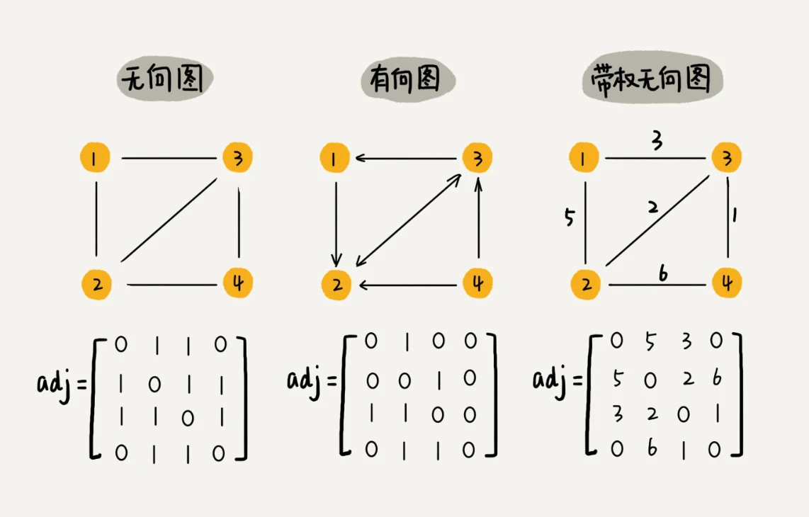

# 树

## 二叉树有几种存储方式？什么样的二叉树适合用数组来存储？

树里面每个元素叫节点，同一个父节点下的子节点叫兄弟节点。没有父节点的节点叫做根节点。没有子节点的节点叫做叶子节点。

## 树的高度，深度，层

高度＝节点到子节点的最长路径
深度＝根节点到这个节点所经历的
层数＝节点的深度＋１（因为从１开始不是从０开始）
树的高度＝根节点的高度

## 满二叉树

## 完全二叉树　

除最后一层其他节点必须全部满子节点，最后一层节点全是左子节点

## 存储二叉树有两个方法

１．基于指针或引用的二叉链式存储法，
２．基于数组的顺序存储法。

数组存储比链路存储省内存的原因就在于不需要存子节点指针，而完全二叉树是最适合的一种存储的

## 二叉树的遍历：前序中序后序三种遍历。

前中后，指的是根节点与左右子树节点遍历打印的先后顺序。

前序：根左右
中：左根右
后：左右根

所以说所谓的前中后对应的是根的位置

时间复杂度o(n)

## 遍历一棵树的两种策略

1.深度有限搜索
2.广度优先搜索(就是按层遍历树)

## dfs解法

# 数组

数组开头下标为0是因为它的寻址方式为
当前下标地址a[i]=首地址+i*数据类型的size
由于删除一个元素需要把后面的所有元素向前搬迁，所以在删除的时候可以先标记元素被删除，当内存不够使再真正删除。
从1开始
a[k]_address = base_address + (k-1)*type_size
比从0开始多了一次减法指令。

我的思路是这样的：我们维护一个有序单链表，越靠近链表尾部的结点是越早之前访问的。
当有一个新的数据被访问时，我们从链表头开始顺序遍历链表。

1. 如果此数据之前已经被缓存在链表中了，我们遍历得到这个数据对应的结点，并将其从原来的位置删除，然后再插入到链表的头部。
2. 如果此数据没有在缓存链表中，又可以分为两种情况：
   如果此时缓存未满，则将此结点直接插入到链表的头部；
   如果此时缓存已满，则链表尾结点删除，将新的数据结点插入链表的头部；

fifo 先进先出
lfu 最少使用
lru 最近最少使用

# 快排

得到标记位数后将数组分为了三段
从头到标记位，标记位，从标记位到结尾

# 图

图分为:有向图和无向图
无向图有度(degree)的概念,度就是顶点有多少条相关联的边.
有向图中度分为入度（In-degree）和出度（Out-degree）
如果还要记录每一条边的长短,那就需要带权图

图的存储
1.邻接矩阵

这样存储虽然直观,但是浪费空间.因为无向图顶点的存储是对角线对称
的我们只存储一个就可以推断另一个的位置.
2.邻接表
即每个顶点对应的链表存储的是该顶点相关联的边.而这种数组套链表的方式就和map差不多.
邻接表虽然比矩阵节省空间,但是查找对应的关系需要遍历链表,链表的存储方式也是缓存不友好的.
ps:对应的,为了快速查找也可以将链表换成红黑树等结构.

图的广度优先搜索(bfs)

