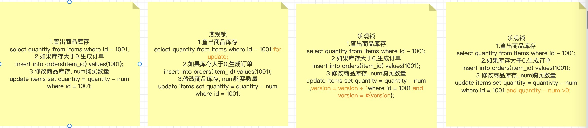

# 总结一下之前的工作项目算是备忘录

## jenkins(ci/cd)

### 普通的任务构建模式

1. general
   丢弃旧的构建策略:保存天数（3），保存个数（1）
2. 源码管理
   git url：https://e.coding.net/huakangyicu/hkmedical/HKMedical_webAdmin.git
   Branches to build：分支名（dev）
3. 构建环境
   Delete workspace before build starts
4. Build
   pom.xml
5. Post Steps
   Run only if build succeeds
6. 执行shell
   BUILD_ID=dontKillMe
   cd /usr/local/medical/webadmin
   sh init.sh
   cp /var/lib/jenkins/workspace/medical-webadmin-new/admin-app/target/medical-web-admin.jar /usr/local/medical/webadmin
   sh restart.sh

### 流水线模式

#### 必须包裹在一个pipeline块中

pipeline {
/* insert Declarative Pipeline here */
}

#### 代理

agent 部分指定了整个流水线或特定的部分, 将会在Jenkins环境中执行的位置，这取决于 agent 区域的位置
pipeline 块的顶层被定义, 但是 stage 级别的使用是可选的

1. any
   在任何可用的代理上执行流水线或阶段。例如: agent any
2. none
   当在 pipeline 块的顶部没有全局代理， 该参数将会被分配到整个流水线的运行中并且每个 stage 部分都需要包含他自己的 agent
   部分。比如: agent none

#### 例子

```
pipeline {
    agent { docker 'maven:3.3.3' }
    //多个步骤
    stages {
        //单个步骤
        stage('build') {
            //具体操作
            steps {
                sh 'mvn --version'
            }
        }
    }
}
```

## nginx

### 反向代理

http {
upstream backend {
server backend1.example.com;
server backend2.example.com;
server backend3.example.com;
}

    server {
        listen 80;

        location / {
            proxy_pass http://backend;
        }
    }

}

## 测试(junit)

### junit5组成

1. JUnit Platform: Junit Platform是在JVM上启动测试框架的基础，不仅支持Junit自制的测试引擎，其他测试引擎也都可以接入。
2. JUnit Jupiter: JUnit Jupiter提供了JUnit5的新的编程模型，是JUnit5新特性的核心。内部 包含了一个测试引擎，用于在Junit
   Platform上运行。
3. JUnit Vintage: 由于JUint已经发展多年，为了照顾老的项目，JUnit Vintage提供了兼容JUnit4.x,Junit3.x的测试引擎。

### 常用注解

* @RunWith(SpringRunner.class)
  Spring上下文集，独立的事务管理，以及其他资源
* @SpringBootTest(classes = {IotApplication.class})
  真正开始初始化bean，执行自动装配。

## 天津深思维科技有限公司

### 一. MRCP服务器：

使用开源的MRCPv2协议服务器unimrcp对语音合成和语音识别等流媒体功能进行封装。

1. 基于unimrcp和各种第三方服务（ASR、TTS），实现了语音合成和语音识别插件。
   调用NLP模型和逻辑推理机实现了语音对话能力。
2. 对接Genesys、联通呼叫中心等平台，对语音识别结果进行模板化处理，方便运维人员现场修改。
3. 使用gdb解决了内存泄漏问题，并对语音合成结果进行缓存，减少了服务调用次数。

```   
#include <stdio.h>

// 定义接口
typedef struct {
    void (*sayHello)();
} MyInterface;

// 实现接口的第一个具体实现
void implementation1_sayHello() {
    printf("Implementation 1: Hello!\n");
}

// 实现接口的第二个具体实现
void implementation2_sayHello() {
    printf("Implementation 2: Hello!\n");
}

// 包装函数，返回函数指针
void (*getHelloFunction(int option))() {
    switch (option) {
        case 1:
            return implementation1_sayHello;
        case 2:
            return implementation2_sayHello;
        default:
            return NULL;
    }
}

int main() {
    // 创建接口实例
    MyInterface interface;

    // 根据需要选择具体的实现
    int option = 1;

    // 获取函数指针
    void (*helloFunction)() = getHelloFunction(option);
    
    if (helloFunction != NULL) {
        // 使用接口方法
        helloFunction();
    } else {
        printf("Invalid option!\n");
    }

    return 0;
}

```

总结:

1. 这里的整个流程就是,将用户的说的话,调用asr将语音转为文字.将文字传入nlp服务,得到回复的文字,调用tts将文字转语音发送给客户,完成一次交互.
   nlp服务是由nlp模型和对话树组成的服务,模型只是为了算语义相似度,用来匹配最合适的话术分支.
2. 整个服务是基于配置的,因为对接了阿里,腾讯,科大迅飞还有一些小的ai厂商的能力,每个厂商的价格和准确率都不一直,所以根据用户购买的不同价格的服务
   配置去调用不同的服务方.
3. 对接这些呼叫中心的时候,由于对方方案老旧和人员流失,对于协议本身已经没有了解的人了,协议body使用了叫做vxml的变体,所以我的做法就是和对方的运维人员进行沟通
   从日志中获取对方标准的body,我把xml写入文件,当服务启动的时候加载到内存,每次返回时基于这个模板做渲染即可.
4. 写c当然就会内存泄漏就要使用gdb查看core dump文件来解决,首先使用ulimit -c命令查看系统是否开启了core dump,如何过没有执行ulimit
   -c unlimited.开启,需要重启系统.
   使用使用 bt 命令可以查看崩溃时的函数调用栈。这将告诉你程序崩溃时所在的函数以及调用关系。
   使用 print 命令可以查看特定变量的值，这有助于了解程序崩溃时的状态。
5. 为了减少调用对tts服务的调用,我们会将一些文字使用md5取一个hash值,然后将这段文字合成语音存储在map里.
6. 内存泄漏就这个map引起的,这个map的策略是每一个kv对缓存3天,但这个map不是并发安全的,当一个kv对失效的时候
   这段语音在内存里已经被free了,但是map中的引用还没有被移除的时候,一个线程用md5的值访问到了,这个被free的内存.导致了野指针.解决方案使用了一个apache
   的c语言运行时里面的并发安全的map.gdb <可执行文件> <核心转储文件>查看代码堆栈信息.

#### core dump

首先开启java core dump -XX:+HeapDumpOnOutOfMemoryError -XX:HeapDumpPath=/path/to/dump/location
在Java生态系统中，有一些工具可以帮助你查看和分析core dump文件，以及进行调试和故障排除。以下是一些常用的工具：

1. **jstack**
   ：jstack是JDK自带的工具，用于生成Java进程的线程堆栈信息。它可以用于查看Java进程当前的线程状态和堆栈信息，帮助分析是否有线程死锁或死循环等问题。使用方式：`jstack <PID>`
   ，其中`<PID>`是Java进程的进程ID。
2. **jmap**
   ：jmap也是JDK自带的工具，用于生成Java进程的内存快照，包括堆内存的使用情况。可以将jmap的输出分析用于查找内存泄漏和内存占用过高的问题。使用方式：`jmap -dump:format=b,file=<dumpfile> <PID>`
   ，其中`<PID>`是Java进程的进程ID，`<dumpfile>`是生成的内存快照文件名。
3. **jvisualvm**
   ：jvisualvm是JDK自带的图形化工具，用于监视、调优和分析Java应用程序。它可以连接到运行中的Java进程，提供线程、内存、GC等信息的图形化展示。在"
   Profiler"选项卡中，也可以打开"heap dump"功能，生成并查看Java进程的内存快照。使用方式：运行`jvisualvm`
   命令，然后在界面中选择要监视的Java进程。
4. **Eclipse MAT**：Eclipse Memory Analyzer
   Tool（MAT）是一款功能强大的内存分析工具，可以帮助查找Java应用程序中的内存泄漏和内存占用问题。MAT可以加载并分析jmap生成的堆内存快照文件。你可以在Eclipse
   IDE中安装MAT插件或者直接下载独立版本使用。
   这些工具都是有助于分析Java应用程序问题的强大工具。对于core
   dump文件的分析，可以使用jmap生成堆内存快照，并使用MAT进行进一步的内存分析。对于线程问题，可以使用jstack查看线程堆栈信息。如果你使用的Java虚拟机是HotSpot
   VM，还可以启用core dump生成，然后使用`jmap`和MAT进行更全面的内存分析。
   在生产环境中，处理core dump文件时要小心，以避免泄露敏感信息和其他安全问题。因此，最好在安全环境中进行调试和故障排除工作。

在Java应用程序发生崩溃或异常时，可能会生成core dump文件，它包含了崩溃时的进程内存状态。可以使用以下步骤来查看Java的core
dump文件：
确认core dump文件的生成：首先，要确保Java应用程序在崩溃或异常时已经生成了core dump文件。在Linux或Unix系统中，默认情况下，core
dump文件通常被写入应用程序的当前工作目录。
安装GDB（GNU Debugger）：GDB是一个强大的调试工具，用于查看和分析core dump文件。确保在系统上安装了GDB。如果尚未安装，可以使用适用于你的操作系统的包管理器来安装GDB。
使用GDB查看core dump文件：打开终端或命令行界面，并执行以下命令：
gdb /path/to/java /path/to/core-dump-file
其中，/path/to/java是Java虚拟机（java）的可执行文件路径，/path/to/core-dump-file是core dump文件的路径。
查看崩溃信息：在GDB命令行界面中，输入bt（backtrace的缩写），可以查看崩溃时的调用栈信息，显示了导致崩溃的代码路径。
分析内存：使用GDB的其他命令，例如print和info，可以查看和分析core dump文件中的内存状态

#### 扩展:websocket集群管理

客户端首先与网关建立WebSocket连接，所有的客户端请求都会通过网关进行转发和路由。网关负责将客户端的请求转发给适当的具体WebSocket服务器处理，并将服务器的响应返回给客户端。

网关的主要功能包括：
连接管理：网关维护和管理所有客户端与具体WebSocket服务器之间的连接。它负责接收和处理客户端的连接请求，创建和维护与WebSocket服务器之间的连接，并在必要时进行连接的动态调整和负载均衡。
路由和转发：网关根据请求的目标地址或其他路由规则，将客户端的请求转发到适当的WebSocket服务器。它可以根据负载均衡算法选择合适的服务器，以确保请求的平衡分布和高可用性。
协议转换：网关可能需要处理不同协议之间的转换。例如，如果客户端使用的是WebSocket协议，而后端WebSocket服务器使用的是其他协议（如TCP或HTTP），网关需要进行协议转换以使两者能够进行通信。
安全性和认证：网关可以提供安全性和认证功能，确保只有经过身份验证的客户端可以建立连接和访问后端WebSocket服务器。它可以进行身份验证、访问控制、加密等操作，以保护通信的安全性和隐私。
通过使用网关来管理和代理所有WebSocket连接，可以实现WebSocket集群的高可用性、负载均衡和灵活的扩展。网关充当了客户端和具体WebSocket服务器之间的中间层，有效地处理了连接管理、路由转发和协议转换等任务，简化了系统架构和开发工作。

gateway做代理,后面需要接两个服务一个ws(通信),一个http(业务).
客户端连接到gateway转发到具体的ws服务器

以下是一个nginx

upstream websocket_backend {
server 127.0.0.1:8000;
server 127.0.0.1:8001;
server 127.0.0.1:8002;
}

server {
listen 80;
server_name example.com;

    location /ws/ {
        proxy_pass http://websocket_backend;
        proxy_http_version 1.1;
        proxy_set_header Upgrade $http_upgrade;
        proxy_set_header Connection "upgrade";
    }

    # 其他配置...

}

当连接建立以后之后,将用户id和对应的服务器ip地址存入redis即可.

### 二. 霍克动力营销系统：

基于微信公众号的营销系统，利用文字对话机器人与关注公众号的用户进行聊天，充当客服的角色。同时，在对话过程中进行数据收集，并为每个对话打上标签。后台管理者可以根据标签对粉丝进行精确的营销活动，以实现私域流量变现的目标。

我的工作：
1.开发了基于Spring Boot的邮件服务，并实现相关业务逻辑。
2.负责开发人工客服模块。
3.提供基于es的聊天记录的查询功能。
4.使用flink对会话记录进行数据统计。

总结:

1. 邮件主要是为了,当有用户发送转人工,而又没有在线客服的时候,发送邮件给固定的运营人员进行提醒.
2. 我们有一个字段toType的字段,这个字段有两个类型,一个是人工,一个是机器人.当用户发送转人工的时候,我们就会去查看那这个字段,如果是人工类型,接下来我们回去,查看
   用户对应的客服的id,当id为null的时候说明还没有客服接待,这时候就需要把用户的toUser设置成这个客服.之后的对话就会转成用户和客服的对话流程.在netty当中链接被封装成了
   context对象,所以我们呢,有两种解决方案.存储一个全局的map<userId,context>,或者将context作为user的一个成员变量.这样就可以在去要发送的数据的时候获取连接.
3. 使用es提供聊天记录的查询,首先要做数据同步,这里我们使用的是基于双写的方案.如何保证mysql和es双写的一致性呢.首先写入mysql失败,直接抛出异常,让客户端重新发请求,
   mysql写入成功,再写入es.在写入es之前记录一条同步日志,es同步成功则更新日志,同步失败则后续根据失败日志,重新同步即可.这种方案类似写入之前记一条预写日志.
   因为没有人会发送成消息立即就去查看历史记录所以不需要考虑同步延迟的问题,由于是之后才会根据失败的日志去做同步补偿,所以是一种最终一致性的方案.双写同步个三方服务,可能会由于网络延迟
   导致实际写入成功,但是回复超时的情况.解决方案有异步:1.回调通知结果,这样就不需要阻塞式的等待了.2.重试机制,重试一定次数后彻底失败.3.记录日志4.定期对比.
   其他同步方案:1.基于消息队列的消息同步2.基于binlog的数据同步.
4. 这里只是使用flink对数据做了简单的word count.编写的大概过程就是连接mysql做数据源,选择时间窗口为滚动窗口模式,保证消息不重复统计,使用本地的set做去重.

## 上海皓齿网络科技有限公司

一. 齿研社小程序和CRM：
齿科医疗服务领域的电商小程序以及商家后台管理系统。

我的工作：
1.根据产品需求进行相关应用的开发，进行周期性版本迭代。
2.对接阿里健康、京东等健康第三方平台的医疗电商平台，实现商品的多平台发布。
3.基于binlog实现数据同步和消息发送功能。
4.利用Elasticsearch实现了综合搜索功能。

### 总结:

1. dts(Data Transfer Platform).
   常见方案的比较
   
   阿里云的dts(基于binlog日志的方案),支持增量同步,全量同步,断点续传.
   好处:实时消费日志,流式处理.日志保证了顺序所以顺序消费数据也是一致的.
   一个数据订阅可以创建最多20个消费组,通过创建多个消费组可以实现数据的重复消费.

2. 当齿研社后台创建一个商品的时候,我们通过dts的数据订阅捕捉到了商品表的一条日志,
   这个日志由statement + row组成,所以我们可以根据dml语句分析出语义,根据数据的变更
   分析出业务的语义,当一条sql是insert语句且table是item表的时候的时候我们需要同步.

   这种同步其实就是一个三方接口同步的场景.
   方案一般有两种:
   1.串行调用,都成功才算成功.缺点:执行时间长用户不友好.
   2.异步方案:优点,无需等待第三方成功,用户友好.

   同步时机:insert,部分update

   异步情况下,调用三方接口同步可能失败.方案一般有四种策略：
   1.三方进行异步回调通知。
   2.重试机制。
   3.记日志，之后补偿。
   4.定时任务做对比。

   我们选择的步骤就是同步成功之后系一条同步日志，那么之后在同步的时候就知道，这个商品已经同步成功了，只需要更新就好了。

   同步初始化的,也就是离线同步,可以从读库同步.我们的做法直接从主库在用户访问低点做快照同步.后续更新的同步由binlog不断发送达到最终一致性.

3. 关于同步的业务，同步到不同的平台需要不同的价格或者比例，所以还需要一张配置表.
   商品code+门店code=货品code作为唯一id.
   当一个item变化的时候就需要向三方同步所有门店的该商品.这里就可以并发的去同步每一个商品.
   同步每一个商品:需要检验一些策略过滤门店,过滤货品,是否配置结算比例
   判断是否已经供货:
   未供货,撤销供货,可以供货
   已供货则更新货品,更新货品则可以查看价格等属性是否发生变化,如果只是时间备注等属性,则无需供货.
   供货前记一条供货初始化日志,供货成功则更新日志状态.
   供货成功则回复ack,供货失败不ack,等待再次消费,或者出发相关消息再次供货,达到一个最终一致性.

4. 搜索相关
   提供综合搜索功能，任意文本搜索商品，`门店，和案例。通过三个大的table定位不同的索引。通过信息聚合生成的大文本content来做任意词命中。

   门店搜索:需求 位置搜索(位置为定位城市), 排序规则(综合排序,离我最近,评价最高),机构(定位城市),综合文本
   便于相关词语可以搜索命中)
   1.使用form,size实现分页.
   2.使用bool query进行复杂条的组合,使用match query做文本匹配.使用term query作等值搜索.
   3.查询条件用ik_smart 分词,存储用ik_max.查询最小粒度分词,存储粗粒度分词.用大分词去匹配小分词,命中概率很低,所以这样设计.
   4.为了让业务可以控制一定的排序顺序,所以需要权重属性.
   5.综合排序可以使用es的隐藏属性_score来排序.
   6.定制化的排序可以在java侧做.

5. 提供接口的鉴权方式
   //加密步骤
   1.使用AppSecret对参数进行aes加密(对称).
   2.使用私钥进行签名生成sign.
   3.对整体报文进行一个base64.
   //解密步骤
   1.对整体报文进行一个反base64,获取明文.
   2.使用AppSecret对参数进行aes解密(对称),获取参数.
   3.使用公钥进行验签,确保请求的正确性.

6. 责任链模式重构订单模块
   1.先写一个抽象的AbstractHandler,handle需要记录下一个handle的引用
   2.HandlerChain编写一个拥有head和tail的链表对象,需要有addHandle方法,如果head==null
   head=handle,tail=handle,如果head!=null,tail=handle,tail.next=handle;

### 数据库，es数据一致性

1. 双写
   先写数据库，再写es，es接口写入超时异常，mysql回滚
2. mq异步写入
3. 定时任务
4. binlog

### 架构以及各个组件的qps

rds mysql 8核16g 独享硬件版本，qps 8000 iops25000，主从。

redis 单机 16g qps 80000，主从。

nginx 单机 4核8g qps 预估值2.5w。大概在10万左右吧

2台web 4核8g，qps没有统计过，最高支持了1小时3万2左右的用户

下单的qps估计是在400左右，每台200（这个应该可以说成tps）

spring gateway 4核8g，官方benchmark
https://github.com/spencergibb/spring-cloud-gateway-bench

## 购物车的大概设计

### 数据结构

// 购物车数据
type ShoppingData struct {
Item       []*Item `json:"item"`
UpdateTime int64   `json:"update_time"`
Version int32   `json:"version"`
}

// 单个商品item元素
type Item struct {
ItemId string          `json:"item_id"`
ParentItemId string          `json:"parent_item_id,omitempty"` // 绑定的父item id
OrderId string          `json:"order_id,omitempty"`       // 绑定的订单号
Sku int64           `json:"sku"`
Spu int64           `json:"spu"`
Channel string          `json:"channel"`
Num int32           `json:"num"`
Status int32           `json:"status"`
TTL int32           `json:"ttl"`                     // 有效时间
SalePrice float64         `json:"sale_price"`              // 记录加车时候的销售价格
SpecialPrice float64         `json:"special_price,omitempty"` // 指定价格加购物车
PostFree bool            `json:"post_free,omitempty"`     // 是否免邮
Activities   []*ItemActivity `json:"activities,omitempty"`    // 参加的活动记录
AddTime int64           `json:"add_time"`
UpdateTime int64           `json:"update_time"`
}

// 活动
type ItemActivity struct {
ActID string `json:"act_id"`
ActType string `json:"act_type"`
ActTitle string `json:"act_title"`
}

### 纯redis实现，选择合适的数据结构

选择string来存储。
缺点是每次修改都需要全量获取，并序列化。

## 华康医促

## 360外包

## 额外项目亮点
给大家分享一个技术优化点。这个是可以写在简历上的点：

简历写：通过技术优化，核销失败数从1000+降低到0

关于营销活动的。

业务A，让我把满减活动加上风控（以前满减活动是不用风控的）
场景1：
S：某一天业务运营C反馈：最近这3天日均有上10+订单核销活动优惠失败数。
T：订单核销失败数为100以内
A：跟着订单id进行链路排查，找日志，发现进行风控调用的时候，风控RPC超时了。和业务A沟通后，业务A只要失败数日均在100以内，都可以接受。好嘛，有一天大促，流量蹭蹭上涨。订单活动核销失败数500+。那就把满减活动降级，不调用风控就好了。
R：我以为把风控关了，就好了

当然，这时候，我以为可以好好休假，准备高枕无忧了。

场景2：

S：第二天，此时我正在休假，业务C反馈：昨天订单核销失败数到1000+了。发来了一堆订单明细。
T：订单核销失败数为0
A：老套路，随便挑一个订单id进行链路日志排查，可以确定的是，这次不用风控了，但是这次却因为抢不到分布式锁失败，但不对啊，为啥会抢分布式锁失败。原来上游订单重试了2次，那为啥会重试2次啊。好嘛，看了一下链路耗时：6S。重试也正常，但毕竟重试次数有限，最多3次。如果多次重试都失败后，自然就不会再调用，所以也就没参与满减活动，自然也就核销失败。
排查思路：参与活动失败—>超重试次数上限—>为啥会重试—>因为6S—>为什么会6S？
好嘛，一看，是扣减活动预算的时候，因为并发，导致多个线程竞争一行数据，触发了锁竞争。自然耗时就上来了。
排查思路变为：参与活动失败—>超重试次数上限—>为啥会重试—>因为6S—>为什么会6S->锁竞争？

为什么会锁竞争？
补充一下背景知识：一个活动有一个预算。就是搞这个活动，不能超过某个金额，超过就结束活动。
底层数据库设计是：一个活动有一个总预算，有多个分页预算。所有分页预算之和等于总预算

细心的小伙伴就会问，既然都已经分页预算了，那为啥还会触发锁竞争哈，应该说是激烈的锁竞争。

因为前任(上一个开发)把分页预算的key设置为：商家id。

要扣哪个分页预算？是取决于商家id的。

分页预算索引=商家id%分页预算数。

在这里，防止有些小伙伴不明白。补充个图


假设一个活动的总预算是100W，然后分10个分页预算，即每个分页预算有10W。

那某一个商家参与活动的时候，需要扣减预算，那扣减哪个分页的预算，这个是需要策略的。

现在的策略就是根据商家id来进行区域。即：分页预算索引=商家id%分页预算数。

假设商家id为3。分页预算索引=3%10，即分页预算索引=3。即会在索引3的分页预算进行扣减预算。

上述如果各位都明白了，就接着往下看。

有小伙伴就会问，既然都已经分页预算了，为啥还有这么激烈的锁竞争哈？

方法1：如果一个活动只有一个总预算，没分页预算时，所有预算扣减都作用在一个活动上。即竞争一条数据。这个扣减预算的粒度是：活动纬度

方法2：如果一个活动有分页预算(如上述的场景)，所有预算扣减会作用在一个活动上，但竞争的是多条数据。这个时候，锁竞争的程度是降低了。因为是用商家id作为策略key，所以扣减预算的粒度是：商家纬度

其实，看到这里，有一些小伙伴就会想到：如果某一个商家的订单巨多，根据商家id策略key，所有线程，都会去竞争同一行数据，这个时候方法2已经自动退化为方法1了。

刚好，这次业务反馈的所有问题订单，都来源于同一个商家。
优化方案是什么？其实很简单，你把策略key，从商家id换为订单id即可。因为订单id不会重复，这样子的话，及时一个商家订单量再多，这个时候，流量是均匀打到每一个分页预算的。

接下来，就是改代码，测试，上线。

R：订单核销失败数为10单以内(我以为大功告成)

当我又以为大公告成的时候，又有问题了。

业务又发来了一堆订单明细(1天10个以内订单)。


好嘛，又有问题。具体是什么问题？
具体问题，就是增加商家参与活动次数的时候，获取分布式锁失败？
分布式锁key=活动id+商家id+门店id+日期(年月日)
继续追问：为什么分布式锁失败？
因为key重复呗。为什么重复，因为这里的纬度：变为门店纬度了。不是订单纬度。
这个活动次数，是必须同步统计的，否则会造成资损。因此不能异步统计。
这个商家，分析了一下，1个商家有2个门店(虚拟门店)
结合上述情景，我这边提出了2个解决方案：
方案1：重试多几次，但仍然可能失败
方案2：增加门店
为什么会增加门店？因为现在门店2个，key过渡集中了。
经过和业务，开发人员商量，最终先把门店增加到10个。先把key分散，减少资源竞争。
可以肯定的是：核销问题导致的失败订单数会减少，但是否为0，等待数据查看。
到这里，先告一段落，后续再补充。
看到这里，其实我们也可以发现流程中有一些不合理，比如：为什么反馈问题需要业务反馈，这种失败的订单数，是否可以自动化，数字化，这样子我们技术开发，可以根据监控报表，自行调整。
当然，除了这些之外，肯定还有其他，如果你看到其他可以优化的点，可以留言提问。
当然，如果你有关于上述不懂的点，有疑问的点，也可以留言或者私聊。