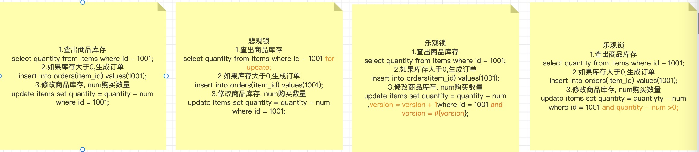

# 总结一下之前的工作项目算是备忘录

## 天津深思维科技有限公司

### 一. MRCP服务器：

使用开源的MRCPv2协议服务器unimrcp对语音合成和语音识别等流媒体功能进行封装。

1. 基于unimrcp和各种第三方服务（ASR、TTS），实现了语音合成和语音识别插件。
   调用NLP模型和逻辑推理机实现了语音对话能力。
2. 对接Genesys、联通呼叫中心等平台，对语音识别结果进行模板化处理。
   使用gdb解决了内存泄漏问题，并对语音合成结果进行缓存，减少了服务调用次数。

```
#include <stdio.h>

// 定义接口
typedef struct {
    void (*sayHello)();
} MyInterface;

// 实现接口的第一个具体实现
void implementation1_sayHello() {
    printf("Implementation 1: Hello!\n");
}

// 实现接口的第二个具体实现
void implementation2_sayHello() {
    printf("Implementation 2: Hello!\n");
}

// 包装函数，返回函数指针
void (*getHelloFunction(int option))() {
    switch (option) {
        case 1:
            return implementation1_sayHello;
        case 2:
            return implementation2_sayHello;
        default:
            return NULL;
    }
}

int main() {
    // 创建接口实例
    MyInterface interface;

    // 根据需要选择具体的实现
    int option = 1;

    // 获取函数指针
    void (*helloFunction)() = getHelloFunction(option);
    
    if (helloFunction != NULL) {
        // 使用接口方法
        helloFunction();
    } else {
        printf("Invalid option!\n");
    }

    return 0;
}

```

总结:

1. 这里的整个流程就是,将用户的说的话,调用asr将语音转为文字.将文字传入nlp服务,得到回复的文字,调用tts将文字转语音发送给客户,完成一次交互.
   nlp服务是由nlp模型和对话树组成的服务,模型只是为了算语义相似度,用来匹配最合适的话术分支.
2. 整个服务是基于配置的,因为对接了阿里,腾讯,科大迅飞还有一些小的ai厂商的能力,每个厂商的价格和准确率都不一直,所以根据用户购买的不同价格的服务
   配置去调用不同的服务方.
3. 对接这些呼叫中心的时候,由于对方方案老旧和人员流失,对于协议本身已经没有了解的人了,协议body使用了叫做vxml的变体,所以我的做法就是和对方的运维人员进行沟通
   从日志中获取对方标准的body,我把xml写入文件,当服务启动的时候加载到内存,每次返回时基于这个模板做渲染即可.
4. 写c当然就会内存泄漏就要使用gdb查看core dump文件来解决,首先使用ulimit -c命令查看系统是否开启了core dump,如何过没有执行ulimit
   -c unlimited.开启,需要重启系统.
5. 为了减少调用对tts服务的调用,我们会将一些文字使用md5取一个hash值,然后将这段文字合成语音存储在map里.
6. 内存泄漏就这个map引起的,这个map的策略是每一个kv对缓存3天,但这个map不是并发安全的,当一个kv对失效的时候
   这段语音在内存里已经被free了,但是map中的引用还没有被移除的时候,一个线程用md5的值访问到了,这个被free的内存.导致了野指针.解决方案使用了一个apache
   的c语言运行时里面的并发安全的map.gdb <可执行文件> <核心转储文件>查看代码堆栈信息.

#### core dump

首先开启java core dump -XX:+HeapDumpOnOutOfMemoryError -XX:HeapDumpPath=/path/to/dump/location
在Java生态系统中，有一些工具可以帮助你查看和分析core dump文件，以及进行调试和故障排除。以下是一些常用的工具：

1. **jstack**
   ：jstack是JDK自带的工具，用于生成Java进程的线程堆栈信息。它可以用于查看Java进程当前的线程状态和堆栈信息，帮助分析是否有线程死锁或死循环等问题。使用方式：`jstack <PID>`
   ，其中`<PID>`是Java进程的进程ID。
2. **jmap**
   ：jmap也是JDK自带的工具，用于生成Java进程的内存快照，包括堆内存的使用情况。可以将jmap的输出分析用于查找内存泄漏和内存占用过高的问题。使用方式：`jmap -dump:format=b,file=<dumpfile> <PID>`
   ，其中`<PID>`是Java进程的进程ID，`<dumpfile>`是生成的内存快照文件名。
3. **jvisualvm**
   ：jvisualvm是JDK自带的图形化工具，用于监视、调优和分析Java应用程序。它可以连接到运行中的Java进程，提供线程、内存、GC等信息的图形化展示。在"
   Profiler"选项卡中，也可以打开"heap dump"功能，生成并查看Java进程的内存快照。使用方式：运行`jvisualvm`
   命令，然后在界面中选择要监视的Java进程。
4. **Eclipse MAT**：Eclipse Memory Analyzer
   Tool（MAT）是一款功能强大的内存分析工具，可以帮助查找Java应用程序中的内存泄漏和内存占用问题。MAT可以加载并分析jmap生成的堆内存快照文件。你可以在Eclipse
   IDE中安装MAT插件或者直接下载独立版本使用。
   这些工具都是有助于分析Java应用程序问题的强大工具。对于core
   dump文件的分析，可以使用jmap生成堆内存快照，并使用MAT进行进一步的内存分析。对于线程问题，可以使用jstack查看线程堆栈信息。如果你使用的Java虚拟机是HotSpot
   VM，还可以启用core dump生成，然后使用`jmap`和MAT进行更全面的内存分析。
   在生产环境中，处理core dump文件时要小心，以避免泄露敏感信息和其他安全问题。因此，最好在安全环境中进行调试和故障排除工作。

在Java应用程序发生崩溃或异常时，可能会生成core dump文件，它包含了崩溃时的进程内存状态。可以使用以下步骤来查看Java的core
dump文件：
确认core dump文件的生成：首先，要确保Java应用程序在崩溃或异常时已经生成了core dump文件。在Linux或Unix系统中，默认情况下，core
dump文件通常被写入应用程序的当前工作目录。
安装GDB（GNU Debugger）：GDB是一个强大的调试工具，用于查看和分析core dump文件。确保在系统上安装了GDB。如果尚未安装，可以使用适用于你的操作系统的包管理器来安装GDB。
使用GDB查看core dump文件：打开终端或命令行界面，并执行以下命令：
gdb /path/to/java /path/to/core-dump-file
其中，/path/to/java是Java虚拟机（java）的可执行文件路径，/path/to/core-dump-file是core dump文件的路径。
查看崩溃信息：在GDB命令行界面中，输入bt（backtrace的缩写），可以查看崩溃时的调用栈信息，显示了导致崩溃的代码路径。
分析内存：使用GDB的其他命令，例如print和info，可以查看和分析core dump文件中的内存状态

#### 扩展:websocket集群管理

客户端首先与网关建立WebSocket连接，所有的客户端请求都会通过网关进行转发和路由。网关负责将客户端的请求转发给适当的具体WebSocket服务器处理，并将服务器的响应返回给客户端。

网关的主要功能包括：
连接管理：网关维护和管理所有客户端与具体WebSocket服务器之间的连接。它负责接收和处理客户端的连接请求，创建和维护与WebSocket服务器之间的连接，并在必要时进行连接的动态调整和负载均衡。
路由和转发：网关根据请求的目标地址或其他路由规则，将客户端的请求转发到适当的WebSocket服务器。它可以根据负载均衡算法选择合适的服务器，以确保请求的平衡分布和高可用性。
协议转换：网关可能需要处理不同协议之间的转换。例如，如果客户端使用的是WebSocket协议，而后端WebSocket服务器使用的是其他协议（如TCP或HTTP），网关需要进行协议转换以使两者能够进行通信。
安全性和认证：网关可以提供安全性和认证功能，确保只有经过身份验证的客户端可以建立连接和访问后端WebSocket服务器。它可以进行身份验证、访问控制、加密等操作，以保护通信的安全性和隐私。
通过使用网关来管理和代理所有WebSocket连接，可以实现WebSocket集群的高可用性、负载均衡和灵活的扩展。网关充当了客户端和具体WebSocket服务器之间的中间层，有效地处理了连接管理、路由转发和协议转换等任务，简化了系统架构和开发工作。

gateway做代理,后面需要接两个服务一个ws(通信),一个http(业务).
客户端连接到gateway转发到具体的ws服务器

以下是一个nginx

upstream websocket_backend {
server 127.0.0.1:8000;
server 127.0.0.1:8001;
server 127.0.0.1:8002;
}

server {
listen 80;
server_name example.com;

    location /ws/ {
        proxy_pass http://websocket_backend;
        proxy_http_version 1.1;
        proxy_set_header Upgrade $http_upgrade;
        proxy_set_header Connection "upgrade";
    }

    # 其他配置...

}

当连接建立以后之后,将用户id和对应的服务器ip地址存入redis即可.

### 二. 霍克动力营销系统：

基于微信公众号的营销系统，利用文字对话机器人与关注公众号的用户进行聊天，充当客服的角色。同时，在对话过程中进行数据收集，并为每个对话打上标签。后台管理者可以根据标签对粉丝进行精确的营销活动，以实现私域流量变现的目标。

我的工作：
1.开发了基于Spring Boot的邮件服务，并实现相关业务逻辑。
2.负责开发人工客服模块。
3.提供基于es的聊天记录的查询功能。
4.使用flink对会话记录进行数据统计。

总结:

1. 邮件主要是为了,当有用户发送转人工,而又没有在线客服的时候,发送邮件给固定的运营人员进行提醒.
2. 我们有一个字段toType的字段,这个字段有两个类型,一个是人工,一个是机器人.当用户发送转人工的时候,我们就会去查看那这个字段,如果是人工类型,接下来我们回去,查看
   用户对应的客服的id,当id为null的时候说明还没有客服接待,这时候就需要把用户的toUser设置成这个客服.之后的对话就会转成用户和客服的对话流程.在netty当中链接被封装成了
   context对象,所以我们呢,有两种解决方案.存储一个全局的map<userId,context>,或者将context作为user的一个成员变量.这样就可以在去要发送的数据的时候获取连接.
3. 使用es提供聊天记录的查询,首先要做数据同步,这里我们使用的是基于双写的方案.如何保证mysql和es双写的一致性呢.首先写入mysql失败,直接抛出异常,让客户端重新发请求,
   mysql写入成功,再写入es.在写入es之前记录一条同步日志,es同步成功则更新日志,同步失败则后续根据失败日志,重新同步即可.这种方案类似写入之前记一条预写日志.
   因为没有人会发送成消息立即就去查看历史记录所以不需要考虑同步延迟的问题,由于是之后才会根据失败的日志去做同步补偿,所以是一种最终一致性的方案.双写同步个三方服务,可能会由于网络延迟
   导致实际写入成功,但是回复超时的情况.解决方案有异步:1.回调通知结果,这样就不需要阻塞式的等待了.2.重试机制,重试一定次数后彻底失败.3.记录日志4.定期对比.
   其他同步方案:1.基于消息队列的消息同步2.基于binlog的数据同步.
4. 这里只是使用flink对数据做了简单的word count.编写的大概过程就是连接mysql做数据源,选择时间窗口为滚动窗口模式,保证消息不重复统计,使用本地的set做去重.

## 上海皓齿网络科技有限公司

一. 齿研社小程序和CRM：
齿科医疗服务领域的电商小程序以及商家后台管理系统。

我的工作：
1.根据产品需求进行相关应用的开发，进行周期性版本迭代。
2.对接阿里健康、京东等健康第三方平台的医疗电商平台，实现商品的多平台发布。
3.基于binlog实现数据同步和消息发送功能。
4.利用Elasticsearch实现了综合搜索功能。

总结:

1. dts(Data Transfer Platform).
   常见方案的比较
   
   阿里云的dts(基于binlog日志的方案),支持增量同步,全量同步,断点续传.
   好处:实时消费日志,流式处理.日志保证了顺序所以顺序消费数据也是一致的.
   一个数据订阅可以创建最多20个消费组,通过创建多个消费组可以实现数据的重复消费.

2. 当齿研社后台创建一个商品的时候,我们通过dts的数据订阅捕捉到了商品表的一条日志,
   这个日志由statement + row组成,所以我们可以根据dml语句分析出语义,根据数据的变更
   分析出业务的语义,当一条sql是insert语句且table是item表的时候的时候我们需要同步.

   这种同步其实就是一个三方接口同步的场景.
   方案一般有两种:
   1.串行调用,都成功才算成功.缺点:执行时间长用户不友好.
   2.异步方案:优点,无需等待第三方成功,用户友好.

   同步时机:insert,部分update

   异步情况下,调用三方接口同步可能失败.方案一般有四种策略：
   1.三方进行异步回调通知。
   2.重试机制。
   3.记日志，之后补偿。
   4.定时任务做对比。

   我们选择的步骤就是同步成功之后系一条同步日志，那么之后在同步的时候就知道，这个商品已经同步成功了，只需要更新就好了。

   同步初始化的,也就是离线同步,可以从读库同步.我们的做法直接从主库在用户访问低点做快照同步.后续更新的同步由binlog不断发送达到最终一致性.

3. 关于同步的业务，同步到不同的平台需要不同的价格或者比例，所以还需要一张配置表.
   商品code+门店code=货品code作为唯一id.
   当一个item变化的时候就需要向三方同步所有门店的该商品.这里就可以并发的去同步每一个商品.
   同步每一个商品:需要检验一些策略过滤门店,过滤货品,是否配置结算比例
   判断是否已经供货:
   未供货,撤销供货,可以供货
   已供货则更新货品,更新货品则可以查看价格等属性是否发生变化,如果只是时间备注等属性,则无需供货.
   供货前记一条供货初始化日志,供货成功则更新日志状态.
   供货成功则回复ack,供货失败不ack,等待再次消费,或者出发相关消息再次供货,达到一个最终一致性.

4. 搜索相关
   提供综合搜索功能，任意文本搜索商品，`门店，和案例。通过三个大的table定位不同的索引。通过信息聚合生成的大文本content来做任意词命中。

   门店搜索:需求 位置搜索(位置为定位城市), 排序规则(综合排序,离我最近,评价最高),机构(定位城市),综合文本(
   便于相关词语可以搜索命中)
   1.使用form,size实现分页.
   2.使用bool query进行复杂条的组合,使用match query做文本匹配.使用term query作等值搜索.
   3.查询条件用ik_smart 分词,存储用ik_max.查询最小粒度分词,存储粗粒度分词.用大分词去匹配小分词,命中概率很低,所以这样设计.
   4.为了让业务可以控制一定的排序顺序,所以需要权重属性.
   5.综合排序可以使用es的隐藏属性_score来排序.
   6.定制化的排序可以在java侧做.

5. 提供接口的鉴权方式
   //加密步骤
   1.使用AppSecret对参数进行aes加密(对称).
   2.使用私钥进行签名生成sign.
   3.对整体报文进行一个base64.
   //解密步骤
   1.对整体报文进行一个反base64,获取明文.
   2.使用AppSecret对参数进行aes解密(对称),获取参数.
   3.使用公钥进行验签,确保请求的正确性.

6. 责任链模式重构订单模块
   1.先写一个抽象的AbstractHandler,handle需要记录下一个handle的引用
   2.HandlerChain编写一个拥有head和tail的链表对象,需要有addHandle方法,如果head==null
   head=handle,tail=handle,如果head!=null,tail=handle,tail.next=handle;